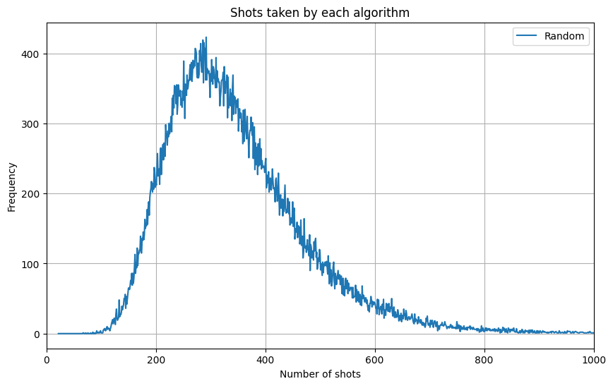
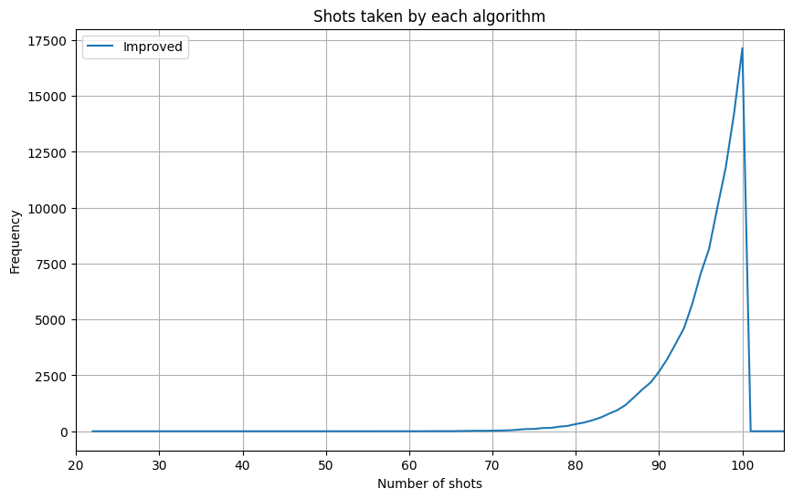
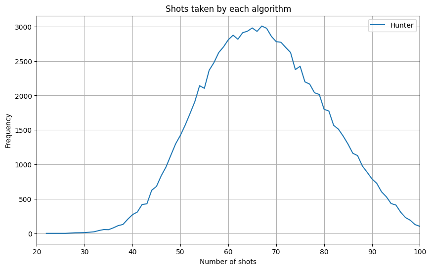
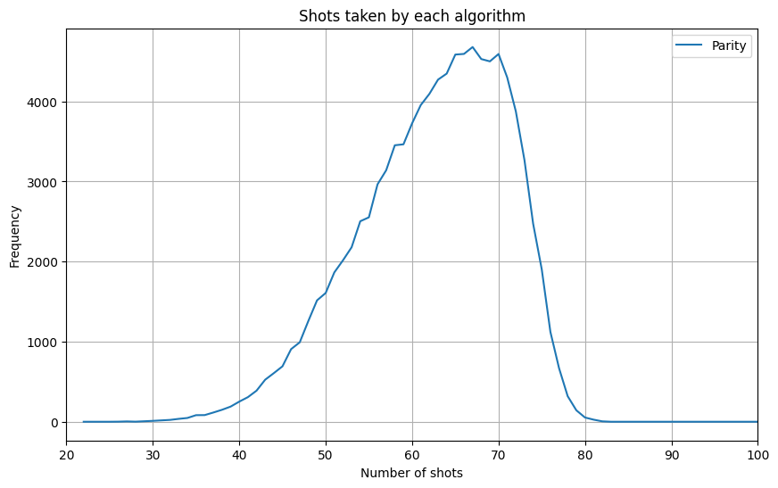
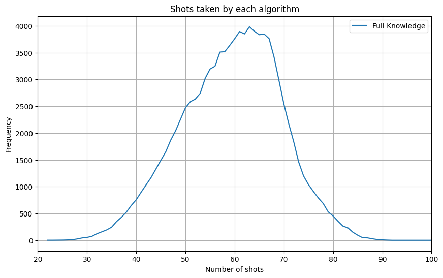
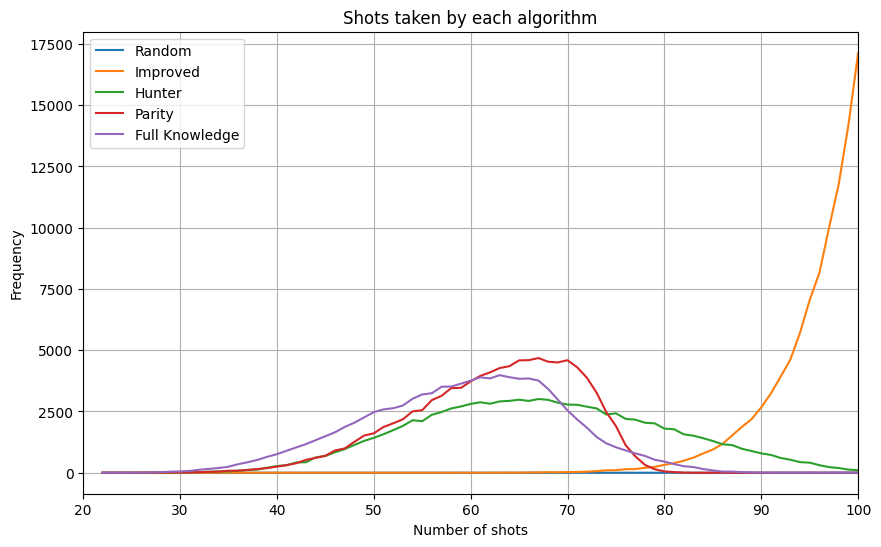

# Explanation on the algorithms

## Introduction

In this project the basic rules of battleship are used:
- There is a 10 by 10 board used
- There are 5 ships in total:
    - 1 with length of 2
    - 2 with length of 3
    - 1 with length of 4
    - 1 with length of 5
- You guess a coordinate to know if you hit, miss or sink a ship
- You win when all ships are sinked

All the data here is obtained by running 100,000 games,

Now let's get into the algorithms.

## Completely random algorithm

This is the simplest algorithm in the project, it only shoots at random coordinates until it wins,
it doesn't care if it's hitting spaces multiple times

On average this method finishes a game in 345 shots

Here is a plot of the distribution of the amount of shots this algorithm needs to finish a game:

This is prety bad considering the board has only 100 spaces, which means that this algorithm is hitting some spaces multiple times, so to improve it we could make it remember where it has shot.

## Improved random algorithm

This algorithm implements a history of all the spaces it has hit, which means that it shouldn't repeat shots and the average should drop dramatically.

On average this method wins in 95 shots. This a big improvement from the last one but you can see that is hitting most spaces since it doesn't care if it hits
or misses since it doesn't have a strategy

And here is the plot:

## Hunter algorithm

This algorithm is the first one that has some strategy that becomes the basis of the next ones.

The strategy consists of 2 modes, I call them search and hunt.

The script starts shooting at random searching for a ship,
then when it hits something it changes to hunt mode and searches the neighbouring spaces
until there is nothing else next to where it has shot.

This algorithm improves a lot form the last ones being the first one that doesn't take close
to the max number of shots needed to finish but it gets a number closer to what humans would get,
this one takes in average 67 shots to win.

And here is the plot:

As you can see in this one you can see the bell curve form the distribution of how likely 
this method is to win on each number of shots.

## Parity algorithm

Now this is where the algorithms get some actual strategy that only people who are serious at battleship care about.

The concept of parity uses the fact that the minimum size of a ship is 2 to pretty much ignore half of the board
and hit spaces in a checkered board pattern since there isn't a reason to hit every space looking for a 1-long ship.

This method improves some on the last one with an average of 62.

Here is the plot:

In this one is interesting how thec curve becomes kinda flat on the right side, meaning that it is taking less,
shots but the average didn't change much.

## Full knowledge algorithm

This is the final algorithm here, it uses all information you can get according to the rules, which means it knows
when a ship is sinked and also what ship was sinked.

This means that we can still use the same parity concept but if we know the 2-long ship was sinked we can instead 
hit the minimum number of spaces for a 3-long ship, and so on always using the smallest ship remaining to 
hit the mimimum number of spaces.

This is also the best method with an average of 59, a sub 60 score, and also this method got the minimum number of shots
of the experiment with only 22, that is impressive considering that there is a maximum number of 17 spaces with a ship on them.

Finally here is the plot:

This one looks similar to the previous one just with a little better average.

## Conclusion

To conclude I wanted to show a plot with all algorithm to see if we can find anything interesting.

I think is there is some good insights we can get from comparing all methods like this, of course
the Improved random algorithm just goes up close to 100 but the other ones are the ones where things happen.

First you can see that the hunter is the only of the 3 "smart" algorithms with a normal looking bell curve then the
other 2 (parity and full knowledge) have curves that go to the right,
also I find it interesting that with the full knowledge and parity you can see that the full knowledge curve 
is a little flatter which means that it does get smaller numbers but it also sometimes finishes with a worse score that the parity algorithm.

